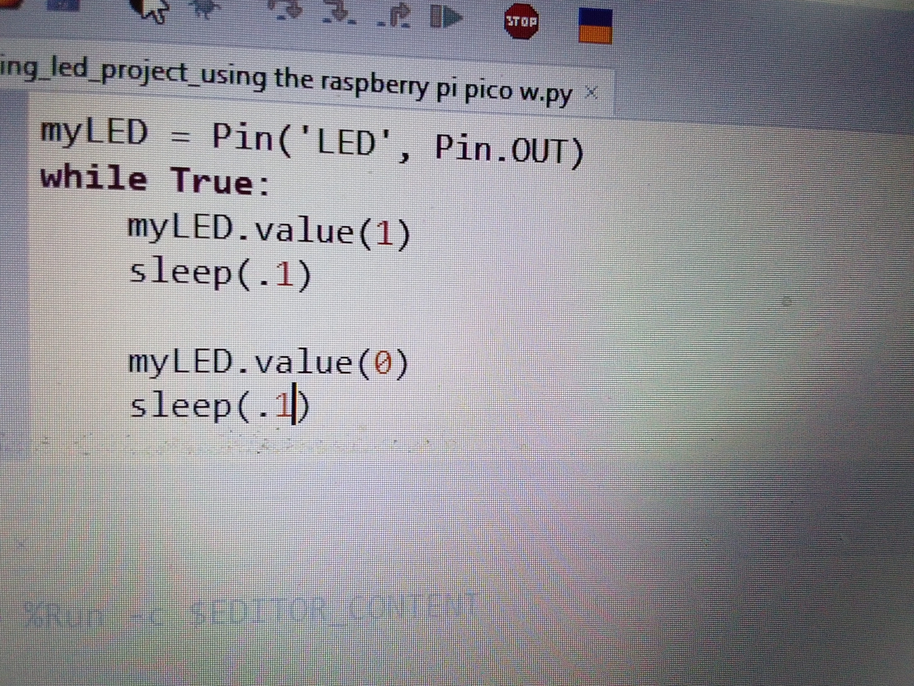

# Blinking-Raspberry-Pi-Pico-W-mounted-LED
This project demonstrates how to blink the built-in LED on the Raspberry Pi Pico W using MicroPython.

## How it works
The LED is turned ON and OFF in a continuous loop with a short delay to create a blinking effect.

## Code behavior
- LED ON for 0.1 seconds
- LED OFF for 0.1 seconds
- Repeats forever

## Hardware
- Raspberry Pi Pico W (no external components required)

## Learning outcome
- Understanding GPIO output
- Using MicroPython Pin library
- Creating delay-based control loops

## Project image

## Project Code
[Click here for the project code](code/blinking_led_project_using_the_raspberry_pi_pico_w.py)

## Project Demostration video
[Click here to check out the Project Demostration video](https://youtu.be/TxRGbjAGqhU)

